# 🛡️ Basic Attack Simulation and Detection Lab using CI/CD and IaC

### 🛠️ Part 1: Building the Cyber Lab Environment
Creating the lab infrastructure in Azure using Terraform and Ansible, and deploying it automatically via GitHub Actions (CI/CD).

### ⚔️ Part 2: Simulating Attacks and Analyzing Traffic

---

## 📁 Project Structure

```
.
├── .github/
│   └── workflows/
│       └── deploy.yml         # GitHub Actions workflow
├── terraform/
│   ├── main.tf                # Main Terraform infrastructure definition
│   ├── outputs.tf             # Terraform output variables
│   ├── terraform.tfvars       # Values for Terraform variables
│   └── variables.tf           # Terraform variable declarations
├── ansible/
│   ├── kali-playbook.yml      # Ansible playbook for Kali VM
│   ├── ubuntu-playbook.yml    # Ansible playbook for Ubuntu VM
│   └── inventory.ini          # Populated dynamically by GitHub Actions
├── .gitignore                 # Ignore key.pem
└── README.md
```

---
## 🛠️ Part 1: Building the Cyber Lab Environment

### 🔧 What are Terraform, Ansible, and CI/CD?

- **Terraform** is an Infrastructure as Code (IaC) tool that lets you define, create, and manage infrastructure on cloud platforms like Azure using simple configuration files.
- **Ansible** is an automation tool used for configuring systems, installing software, and executing tasks across remote machines using playbooks (YAML files).
- **CI/CD (Continuous Integration/Continuous Deployment)** is a software development practice that automates the integration and delivery of code and infrastructure, allowing for consistent, repeatable, and fast deployments. Here, GitHub Actions serves as our CI/CD orquestrator.

##

### 🖥️ VM Creation with Terraform:
- 1 VM: Kali Linux (for offensive tools)
  
  **Why Kali Linux?:**
    - It's purpose is: offensive security, penetration testing, ethical hacking.
    - Comes with many security tools pre-installed.
    - It's common to use Kali as the attacker and Ubuntu as the target in cybersecurity projects or labs.
      
- 1 VM: Ubuntu (for monitoring and packet capture)
  
   **Why Ubuntu?:**

  - It's a stable, widely supported Linux distribution often used for servers and monitoring setups.

  💡 **On this VM**, we allow both SSH key-based and password-based authentication.
  This is to enable password-based login scenarios, such as brute-force SSH attacks during Part 2. This configuration simulates real-world systems that are sometimes exposed with password access.
  
Specifics (for better Azure credit optimization):
- B1s (1vCPU, 1 GB RAM) for Ubuntu
- B2s (2vCPU, 4 GB RAM) for Kali (for better performance)

### 🗂️ Terraform File Overview

#### `main.tf`
This is the main configuration file where the infrastructure is declared. It defines:
- **Resource Group:** A container that holds related Azure resources such as VMs, virtual networks, and public IPs. It's useful for managing permissions, billing, and cleanup.
- **Virtual Network (VNet):** Provides an isolated and secure network within the Azure cloud where our VMs can communicate.
  
   **Why do we need a VNet?:**
    - To simulate attacks internally between VMs (Kali attacking Ubuntu), and we want that traffic to be isolated from the public internet.
    - Monitoring tools (Zeek) live inside the virtual network.
    - A VNet lets you control the security and visibility of network traffic, just like in a real SOC or data center.
      
- **Subnet:** A smaller, more specific piece of a larger network (in this case, the Azure Virtual Network). This is necessary to define IP ranges for VMs.

  **How are VNets and Subnets related?:**
    - The virtual network (VNet) is a big neighborhood — for example, 10.0.0.0/16 (65,536 IPs available).
    - A subnet is one street in that neighborhood — for example, 10.0.1.0/24 (256 IPs available).
  
  **IP Address Assignment:**
    - Azure won’t assign IPs to VMs unless they belong to a subnet. It’s how Azure knows:
      - What IP range to assign
      - What security policies to enforce
      - How to route traffic
      
  Each subnet gets its own range of IP addresses within the larger address space of the virtual network.
  
- **Public IPs:** Each VM is assigned a dynamic public IP to be accessible remotely via SSH.
- **Linux Virtual Machines:** One Kali and one Ubuntu VM, each with their own **network interface** (The NIC or Network Interface Card connects the VM to the virtual network and public IP) and SSH access.


#### `variables.tf`
Declares the variables used throughout the Terraform configuration such as:
- Azure region
- Resource group name
- VM size and admin username
- SSH public key
- Admin password (used only for Ubuntu)

These variables can be customized via `terraform.tfvars`.


#### `outputs.tf`
Defines which values Terraform should return after applying the infrastructure. In this case:
- Public IPs for the Kali and Ubuntu VMs

These are used by the GitHub Actions workflow to dynamically generate an Ansible inventory.

##
### ⚙️ VM Configuration with Ansible
- **Kali VM:**
  - `nmap` (for port scanning)
  - `hping3` (for packet crafting/flooding)
  - `hydra` (for brute-force testing)
    
- **Ubuntu VM:**
  - Monitoring tools:
    - `wireshark` 
    - `tcpdump` 
    - `zeek`


### 🗂️ Ansible File Overview

#### `inventory.ini`

🧾**What is an Ansible Inventory?**

 An inventory file defines the hosts Ansible will connect to, how to reach them, and what login credentials or SSH settings to use. It is essentially a list of target hosts grouped by names.

 On this project, it is **generated dynamically** by the GitHub Actions workflow using the output IPs from Terraform.

**Example format:**
```
[kali]
kali-vm ansible_host=xx.xx.xx.xx ansible_user=azureuser

[ubuntu]
ubuntu-vm ansible_host=yy.yy.yy.yy ansible_user=azureuser
```
- This allows Ansible to know which machines to target and how to connect (username and IP).
- 💡 You can think of the inventory as the address book for Ansible.


📜**What is an Ansible Playbook?**
- A playbook is a YAML file where you define the tasks (scripts) Ansible should run on your servers. It contains:

  - The hosts (from the inventory group) to target
  - Tasks (like installing software, updating packages, configuring settings)
  - Options like privilege escalation (become: yes)

#### `kali-playbook.yml`
A playbook that configures the **Kali VM** with penetration testing tools. It:
- Connects to the host in the `[kali]` group
- Uses `apt` to:
  - Update the package list
  - Install tools like `nmap`, `hping3`, and `hydra`

For example, this playbook says:
- “Connect to the hosts in the kali group, become root, and install nmap, hping3, and hydra.”

💡 **Note:** These tools may already come pre-installed on Kali Linux. However, we explicitly install them using Ansible to ensure consistency across environments and to make the setup process fully reproducible.

#### `ubuntu-playbook.yml`
A playbook that configures the **Ubuntu VM** with monitoring tools. It:
- Connects to the host in the `[ubuntu]` group
- Uses `apt` to:
  - Update the package list
  - Install tools like `wireshark`, `tcpdump`, and `zeek`

##
### 🔒 SSH key-based login is used to access the VMs

🔐 **What Are SSH Key Pairs?**

An SSH key pair consists of two linked cryptographic files:

- Public key (e.g., id_rsa.pub): This is placed on the server (Azure VM).

- Private key (e.g., id_rsa): This stays on your computer. You never share it.

They work together like a lock and key:

- The server “locks” access with the public key.

- Only your private key can “unlock” and log in.

**In this  setup:**

- Both VMs are accessible using SSH key authentication.
- The Ubuntu VM also accepts password-based login to allow brute-force attack simulations in Part 2.


---

### 🚀 What happens when the workflow gets triggered?

A fully functional cybersecurity lab in Azure consisting of a Kali Linux machine (for offensive tools) and an Ubuntu server (for monitoring tools) gets gets deployed on the configured Azure subscription.

### 🔄 Automation Pipeline

The `.github/workflows/deploy.yml` file defines a CI/CD pipeline that:
1. Initializes and applies Terraform to create infrastructure
2. Retrieves public IPs from Terraform output
3. Dynamically generates an Ansible inventory file
4. Runs Ansible playbooks to configure both VMs
5. Cleans up temporary SSH key from the runner

This allows for full automation of the infrastructure deployment and provisioning process with one GitHub Action run.

```mermaid
graph TD
  A[📦 Trigger the Workflow] --> B[🧲 GitHub Actions Workflow:]
  B --> C[☁️ Terraform: Create Azure Resources]
  C --> D[📤 Terraform Outputs: Kali and Ubuntu Public IPs]
  D --> E[🗂️ Generate Ansible Inventory]
  E --> F[📜 Ansible: Configure Kali VM]
  E --> G[📜 Ansible: Configure Ubuntu VM]
  F & G --> H[✅ Lab is Ready for Use]
```

<details> <summary>🔽 <h4>Click here to view the deployment flow diagram</h4></summary>


</details>

---

### 🔑 Prerequisites

- Azure subscription
- A service principal with Contributor role. See here how to generate a service principal on Azure.
- An SSH Key Pair.
  - Store the private key securely in GitHub Secrets (`SSH_PRIVATE_KEY`).
  - Repalce the public key in `terraform.tfvars` with the new matching key.
- GitHub repository with the following secrets:

  - `ARM_CLIENT_ID`
  - `ARM_CLIENT_SECRET`
  - `ARM_SUBSCRIPTION_ID`
  - `ARM_TENANT_ID`
  - `SSH_PRIVATE_KEY` (the private key matching the public key in `terraform.tfvars`)

---

### 🧪 Create the lab

1. Fork this repository
2. Add the GitHub Secrets listed above
3. (Optional) Review or edit `terraform.tfvars` to adjust region, username, VM size, etc.
4. Go to GitHub → Actions tab → Run the Deploy workflow manually

---

## 🛠️ Part 2: Simulating Attacks and Analyzing Traffic

In this part, we use the infrastructure created in Part 1 to simulate basic cyberattacks using the Kali Linux VM and analyze their impact using monitoring tools installed on the Ubuntu VM.

---

### 🧰 Tools Involved
  - **On Kali Linux (Attacker)**:
    - `nmap`: for port scanning
    - `hping3`: for sending custom TCP/IP packets (e.g., SYN flood)
    - `hydra`: for brute force attacks on services like SSH or FTP

  - **On Ubuntu (Monitor/Target)**:
    - ####  `tcpdump` :
      - It's a command-line tool for capturing and inspecting network traffic in real time.
      - It listens on a network interface (e.g., eth0) and prints out packet information as it sees it. We can use filters (like port numbers, protocols, IPs) to focus on specific traffic too.
      - We'll use this tool to capture raw packets into `.pcap` files for deeper analysis later.

    - #### `wireshark` :
      - It's an open-source network protocol analyzer. It captures and displays packets of data that flow through a network, allowing the user to inspect what’s happening at a very detailed level (from the Ethernet frame all the way up to the application data).
      - **GUI for Packet Analysis:** We'll use this so we can visually analyze the `.pcap` files generated by `tcpdump`.

    - #### `zeek` :
      - Zeek is a powerful network analysis framework designed for detecting suspicious activity on a network. It’s used in security operations centers (SOCs).
      - It passively monitors traffic like `tcpdump`, but instead of just logging raw packets, it analyzes them and writes detailed logs:
        - `conn.log` → all connection summaries
        - `http.log`, `ssh.log`, `dns.log`, etc. → protocol-specific logs
        - `notice.log ` → alerts about suspicious behavior

---

### 🔗 Connecting to the VMs

To perform attacks or monitor network traffic, we’ll need terminal access to both virtual machines (Kali and Ubuntu). 

Since Azure Cloud Shell only allows one terminal session per VM at a time, it's recommended to connect to your VMs via SSH from your local computer.

#### Before connecting, make sure you have:

- The private SSH key (`key.pem`) that matches the public key used in `terraform.tfvars`.

💡 **Important:** Make sure your SSH key file has correct permissions:

```
chmod 600 key.pem
```
##

### 🔐 Connect to the VMs
To connect to a VM, open a terminal on your local computer and use the following command:

```
ssh -i path/to/key.pem azureuser@<vm_public_ip>

```
- Replace  `path/to/key.pem ` with the path to your private key file.

- `azureuser` is the admin username used in `terraform.tfvars`, if you changed it replace it here.
- Replace `<vm_public_ip>` with the public IP address of one of the VMs (output from Terraform).

Repeat this process to connect to the other VM or to open multiple terminal windows to run commands in parallel.

---

## ⚔️ Attack Scenarios


### 👁️‍🗨️ Monitoring Setup

Before running each attack, we will first configure our monitoring tools. This ensures that the traffic is properly captured and logged for analysis. By repeating this setup for every attack, we can:

- Keep evidence isolated per technique
- Make analysis easier and logs cleaner
- Create smaller and more focused .pcap files

This practice is especially important in labs like this one, where the goal is to learn and analyze each attack’s behavior individually.

- On a terminal connected to the Ubuntu VM, we run:

  ```
  sudo tcpdump -i eth0 -w tcp_conn.pcap
  ```
  - We'll name each output file based on the scan or attack being performed, so that the logs are organized and easier to identify later.

  **What this does:**

  - `-i eth0` → Listen on interface **eth0** (the VM’s main network interface. We can always check using `ip link` or `ifconfig`, to be sure which one is actively transmitting and receiving data).

  - `-w tcp_conn.pcap` → Write the raw captured packets directly to a file named `tcp_conn.pcap` (`tshark`, Wireshark's terminal version can also be used to do this). 

  - No filters applied → Captures all traffic on that interface.
  -  `tcpdump` will start capturing traffic and writing it to the file `tcp_conn.pcap` .


- On another terminal connected to the Ubuntu VM, run: 
  ```
  sudo zeek -i eth0
  ```
  - This will run Zeek on the **eth0** interface.
  - Zeek passively monitors the network interface.
  - It will start logging immediately in the default directory (`/opt/zeek/logs/current/`).

- To see the log as it grows on real time, we can run on another terminal:
  ```
  tail -f /opt/zeek/logs/current/conn.log
  ```
##

### 🕵️‍♀️ 1. Port Scanning using Nmap

##

### 🔍 Port Scanning 
One of the most fundamental reconnaissance techniques is port scanning. We use `nmap` to detect which ports are open on the target VM.

#### What is port scanning?:
It's a method used to discover open ports and services on a target system or network. It involves sending packets to various ports to determine which ones are open and listening, providing attackers with information to exploit vulnerabilities. 
##
### 🤝 The TCP Handshake 
To understand how TCP Connect and SYN scans work (and SYN Floods, the attack we´ll perform afterwards), it’s important to know how a typical TCP connection is established.

It´s purpose is to establish a reliable connection between a client and a server to ensure that both sides are ready to communicate before any data is transmitted. This process is also known as the **3-way handshake**:

**1. SYN (Synchronize)  →** The client sends a SYN packet to the server to request a connection.
   
**2.  SYN-ACK (Synchronize-Acknowledge)  →** If the port is open, the server responds with a SYN-ACK.  The ACK flag acknowledges the client's initial SYN, and the SYN flag initiates the server's connection request back to the client.
   
**3.  ACK (Acknowledge) →** The client sends back an ACK, acknowledging the server's SYN-ACK to complete the handshake. Both client and server are now aware of the connection and ready to transmit data.

- 💡 If any of these steps fail, the connection does not fully establish. This behavior is what scanners like nmap exploit to detect open, closed, or filtered ports.
##
#### What is Nmap?:
`nmap`, short for Network Mapper, is a powerful open-source network discovery and scanning tool used primarily for: host discovery, port scanning, OS and service detection.

##

### 🔍 TCP Port Scanning Techniques

#### 👣 TCP Connect Scan (-sT option in Nmap)

- Performs a full 3-way handshake **(SYN → SYN-ACK → ACK)**.
- Uses the operating system’s network stack (the part of the OS that's in charge of network communication). This means that the OS handles:
  - Sending the SYN packet
  - Receiving the SYN-ACK
  - Sending the ACK to complete the handshake
  - Keeping the connection open or closing it cleanly
    
  **Why does this matter?:**
  - Using the OS's network stack is considered normal TCP behavior. It's easier but more detectable (leaves logs).

- If the port is open, the connection is fully established, and then closed.

**Advantages:**
- Does not require root privileges because we're not using raw packets (the OS's network stack handles the packets).

**Disadvantages:**
- Easy to detect by firewalls and intrusion detection systems (IDS), because it behaves like normal traffic.
- Leaves logs on the target system (because the connection is fully established and closed).

##
#### 🕵️ TCP SYN Scan (-sS option in Nmap)

This is also known as a **half-open scan or stealth scan**:

- Nmap sends a SYN packet.
- If the port is open, the server replies with a SYN-ACK.
- But instead of replying with an ACK (step 3, to complete the handshake), Nmap sends an RST (reset) to tear down the connection immediately.

So the connection is never fully established, only the **SYN → SYN-ACK** part happens.

**Advantages:**
- **Stealthier:** It doesn’t complete the handshake, so it’s less likely to be logged or trigger alarms.
- Faster and more efficient than a full TCP connection.

**Disadvantages:**
- Requires root privileges (or admin on Windows) because it needs to craft **raw packets**.

##

#### What are Raw Packets?:
A “raw packet” is a network packet that is created and sent manually, rather than being constructed automatically by the operating system’s networking stack. 

**With raw packets, a program:**

- Manually creates its own packet from scratch (or with special tools)

- Sets flags like SYN, ACK, etc.

- Sends the packet over the network without letting the OS manage the connection

💡 Powerful but requires admin/root privileges. It's used for stealthy port scanning, custom attack simulations and penetration testing.

##

### 🔎 Performing the Scans:
### TCP Port Scan Comparison: TCP Connect vs. TCP SYN Scan

Now, we’ll run two types of scans from the Kali VM to the Ubuntu VM and compare how they look from both the attacker's and defender's / targets's perspectives.

The goal here is to simulate **reconnaissance activity** (what an attacker might do to fingerprint open services on a target) and analyze the traces that these two scans leave on the target machine.

In cybersecurity, **reconnaissance** is typically the first phase of an attack, as it focuses on gathering information about the target system or network.


##

### 1️⃣ TCP Connect Scan

#### 👁️‍🗨️ Start Monitoring on Ubuntu VM

1. Run the commands listed above on the Monitoring Setup section.
2. We´ll name the file `tcpdump` is going to write on: `tcp_conn.pcap`.
  
##
#### 🔎 Performing the Scan

- On a terminal connected to the Kali VM, run the following command:

  ```
  nmap -sT 10.0.1.X
  ```

  **What this does:**
  - `-sT` is the option used on Nmap to perform a **TCP Connect Scan** on the target IP address or hostname.

 `10.0.1.X` is the private IP address of the Ubuntu VM. This is the IP address used inside the VNet we defined when creating the infrastructure (use `ip a` or check Azure Networking tab).

⚠️ **Important:** Although these scans—and the attacks we'll perform later—can technically be directed at the target VM's public IP, it's not recommended because:

  - Doing so exposes the attack traffic to the internet, which could raise security flags, violate acceptable use policies, or cause issues with your Azure account.
  - Tools like Zeek or tcpdump provide cleaner and more realistic analysis when monitoring internal traffic over the private IP.


##

### 📊 Results and Analisis After a TCP Connect Scan

- Stop Zeek and tcpdump using `Ctrl + C` once the scan completes, to have isolated evidence per scan or attack.

**On Kali:**
- Nmap performed a full 3-way handshake to check which ports are open. 

- Output:

**On Ubuntu:**
- To print Zeek's log run: 
  ```
  cat /opt/zeek/logs/current/conn.log
  ```
  - Zeek logs in `conn.log` will log full connection entries, with orig and resp IPs and completed handshakes.

  - In Zeek’s `conn.log` file, the state of a TCP connection is represented by a two-character code. These states reflect how far the connection progressed and what Zeek saw. Here’s a list of ones we might see in the log:

  | Code   | Meaning                                                                 |
  | ------ | ----------------------------------------------------------------------- |
  | S0     | Connection attempt seen (SYN) but no reply                              |
  | S1     | Connection established (SYN → SYN-ACK) but no final ACK from originator |
  | S2     | Connection established and handshake completed, but no data sent        |
  | S3     | Handshake completed, data sent in at least one direction                |
  | SF     | Normal connection; data sent in both directions; closed cleanly         |
  

- We'll check the `tcp_conn.pcap` file using `tshark` (terminal-based version of Wireshark). Run:
  ```
  tshark -r tcp_conn.pcap
  ```
  - tcpdump will show full connection attempts (SYN → SYN-ACK → ACK).

  Here's the same file using Wireshark GUI ().

- Let's also check SSH logs on `/var/log/auth.log` running:
  ```
  grep "sshd" /var/log/auth.log
  ```
  - This filters the log to show only entries related to the SSH daemon.
 
  - A full TCP Connect scan using nmap -sT triggers SSH logs because the port is open and the entire TCP three-way handshake with the SSH service (running on port 22) is completed, that makes it look like a legitimate connection attempt to the system.

  - Since the connection is fully established, the target service (e.g., SSH daemon) sees it as a real client attempting to connect.

##

### 2️⃣ TCP SYN Scan

#### 👁️‍🗨️ Continue Monitoring on Ubuntu VM

1. Run the commands listed above on Monitoring Setup.
2. We´ll name the file `tcpdump` is going to write on: `tcp_syn.pcap`.

##
#### 🔎 Performing the Scan

- On a terminal connected to the Kali VM, run the following command:

  ```
  sudo nmap -sS 10.0.1.X
  ```
  - `-sS` is the option used on Nmap to perform a **TCP SYN Scan**.
  - To run this command root privileges are needed because Nmap sends raw SYN packets (a manually crafted TCP packet that has the SYN flag set to 1, it's used specifically to initiate a connection, only to see how the target responds). 

##

### 📊 Results and Analisis After a TCP SYN Scan

- Stop Zeek and tcpdump using Ctrl + C once the scan completes.

**On Kali:**
- Nmap only sends the SYN and receives SYN-ACK. It never completes the handshake.
- Faster and more stealthy.

- Output:

**On Ubuntu:**
- Zeek's log: `/opt/zeek/logs/current/conn.log`

  - Zeek may still log them in conn.log, but as "incomplete connections" with a S0 state.

- We'll check the `tcp_conn.pcap` file using `tshark` (terminal-based version of Wireshark). Run:
  ```
  tshark -r tcp_conn.pcap
  ```
  - tcpdump will show SYN packets from Kali but no ACKs back.
  **Filters to apply:**
  - tcp.flags.syn == 1 && tcp.flags.ack == 0 → shows SYNs

  - tcp.flags.syn == 1 && tcp.flags.ack == 1 → shows SYN-ACKs

  - tcp.flags.reset == 1 → shows RSTs (used in SYN scan tear-down)

  Here's the same file using Wireshark GUI ().

- Let's also check SSH logs on `/var/log/auth.log`:

  - No entry is made in  `/var/log/auth.log`. SSH doesn’t consider it a real connection although the OS may still log it at a firewall or IDS level.


##
### Zeek conn.log Sample Comparison

| Field    | TCP Connect Scan (-sT)   | TCP SYN Scan (-sS)       |
| -------- | ------------------------ | ------------------------ |
| State    | SF (connection finished) | S0 (SYN seen, no reply)  |
| Duration | >0 seconds               | 0.000                    |
| Notes    | Normal traffic           | Potential reconnaissance |

##

### 🔎 Why Do Attackers Scan for Open Ports?

Understanding open ports and their associated services gives attackers valuable insight into how a system is structured and what vulnerabilities might exist.


Each open port indicates a reachable service. These services may have vulnerabilities or weak configurations that can be exploited.

* **Example:** If port 22 (SSH) is open, attackers may attempt brute-force login using tools like `hydra`. This is one of the attacks we´ll perform.
* If port 80 or 443 is open, they may probe for outdated web server software or exposed admin panels.

Identifying which ports are filtered helps map defensive systems like firewalls or IDS. It reveals the network's visibility and protection strategy.

#### Service Fingerprinting
This is a technique used to identify the specific software and version running on a given open port or network service.

As we observed on the output after performing the scans, scanning tools can reveal software versions and configurations. With this information, attackers can:

* Search for known vulnerabilities (Common Vulnerabilities and Exposures or CVEs) for specific versions.
* Tailor **exploits** (a method or piece of code that takes advantage of a vulnerability) to maximize the chance of success.

Once attackers know which ports are open, they can focus only on those, reducing their footprint and likelihood of detection.


##

### 🛟 2. SYN Flood using hping3
##

The gloal here is to simulate a **Denial-of-Service (DoS)** attack by overwhelming the Ubuntu VM (target) with a high volume of SYN packets. 

#### 🛑 Denial of Service (DoS):

- A type of cyberattack where an attacker deliberately tries to make a system, network, or service unavailable to its intended users. The goal is to overwhelm the target with traffic or requests so that it can no longer respond to legitimate users.

#### 🚣‍♂️ SYN Flood

A **SYN flood is a type of Denial-of-Service (DoS) attack** that targets the TCP connection handshake process. Its purpose is to exhaust the target system’s resources by initiating a massive number of incomplete TCP connections.

**In a SYN flood attack:**

- The attacker sends a large number of SYN packets to the target.

- The target responds with SYN-ACKs (assuming the port is open), allocating resources (like memory or connection slots) for each potential connection.

- The attacker never sends the final ACK, leaving the connections in a half-open state.
- Services with open TCP ports (e.g., SSH on port 22 or HTTP on port 80) are targeted.
- The attacker may often use **spoofed IP addresses** to make tracing difficult. 

- If enough SYNs are sent in a short time, the server’s connection table fills up. Legitimate users can’t connect,  resulting in a **Denial of Service.**


##
#### 🧐 What Are Spoofed IP Addresses?
These are fake or forged IP addresses that an attacker uses to disguise the true origin of a network packet. The attacker replaces the real source IP address in a packet's header with another one, often the IP of a trusted system or a random address. 

By faking the source address, the attacker makes it hard to trace where the attack came from. **This technique is called IP Spoofing.**

- In a **SYN flood DoS attack**, spoofed IPs are often used to send thousands of SYN packets to a server and make the server try to respond to fake clients (that never reply).

This makes the attack harder to detect and defend against, because the connections seem to come from many random sources.

##
#### 📥 TCP Window Size and Its Role in a SYN Flood

When sending a SYN packet, attackers can manually set a TCP window size value. Normally:

- The TCP window size is advertised by the receiver to indicate how much data it can buffer before needing an acknowledgment (ACK).

- In a SYN packet, the sender also includes a window size indicating how much data it’s prepared to receive (this is normal TCP behavior).

🚣‍♂️ **In the context of a SYN flood:**

- The attacker sets a very small window size (e.g.,`-w 64`) to appear as a client with limited buffer capacity.

- This can trick the target into allocating additional memory buffers or managing more overhead per connection, especially on large volumes of SYNs.

- Combined with thousands of SYNs, this can accelerate resource exhaustion on the server.

💡 While it’s normal for SYN packets to advertise a window, setting small values on purpose (repeatedly and at high volume) is suspicious and may be flagged by IDS tools like Zeek.


##
### 🛟 SYN Flood Attack

#### 👁️‍🗨️ Continue Monitoring on Ubuntu VM

1. Run the commands listed above on Monitoring Setup.
2. We´ll name the file `tcpdump` is going to write on: `tcp_flood.pcap`.

#### 🔥 CPU / Memory Usage
Run `top` or `htop` while the attack is happening to see how the system resources respond on real time to the attack. 


##
#### ⚔️ Performing the Attack:
- On a terminal connected to the Kali VM, run the following command:
```
hping3 -c 10000 -d 120 -S -w 64 -p 80 --flood --rand-source 10.0.1.X
```

**What does this mean?:**

With this command, we are crafting custom SYN packets. This is known as **packet crafting**, because we´re bypassing the standard OS network stack and manually setting TCP header fields.

  | Flag            | Meaning                                                            |
  | --------------- | ------------------------------------------------------------------ |
  | `-c 10000`      | Send 10,000 packets                                                |
  | `-d 120`        | Each packet contains 120 bytes of data                             |
  | `-S`            | Set the SYN flag (initiates TCP connection – like a SYN scan)      |
  | `-w 64`         | Set the TCP window size to 64 (see explanation above)              |
  | `-p 80`         | Target port 80 (commonly used for HTTP)                            |
  | `--flood`       | Send packets as fast as possible without waiting for replies       |
  | `--rand-source` | Randomize the source IP address of each packet **(spoofed addresses)** |
  | `10.0.1.X`      | Target private IP address of the Ubuntu VM                         |

⚠️  **Important:** Using `-c` (count) limits the amount of packets being sent. Without it, the `--flood` option would tell `hping3` to send packets as fast as possible, indefinitely. The flood will only stop when: 

- You manually interrupt it (e.g., with Ctrl+C)
- The system kills the process (e.g., due to resource exhaustion)

This approach is more aggresive and can trigger security alerts or bandwidth limits on cloud platforms like Azure.


##
**Why Would the Packets Contain any Data?** (`-d 120`)

A SYN packet (the first step of a TCP handshake) does not contain a data payload. It typically only carries the TCP header and control flags (like the SYN flag) and no actual content.

By using `-d 120`, we are adding 120 bytes of data to each SYN packet. 

 **Why would an attacker do this?**

- To increase the size of the packet and consume more bandwidth.

- To try to bypass basic firewalls or detection systems that expect SYNs to be small.

- To stress the target system more, as it must allocate resources to handle larger packets.

##
#### What Happens as You Increase the Number of Packets?
When launching a SYN flood attack, increasing the number of packets (e.g., using `-c 10000` or `--flood`) has direct consequences on both the attacking and target systems.

#### 📤 On the Attacker Side (Kali VM):
- **Increased CPU and bandwidth usage:** Generating and transmitting a large number of crafted packets consumes system resources.

- **Greater risk of packet drops:** If the sending rate is too high, some packets might be dropped before leaving the interface.

- **Easier to detect:** Flooding traffic can trigger alerts in intrusion detection systems or rate-limiters on the network.

#### 📥 On the Target Side (Ubuntu VM):
- **TCP connection queue fills up:** The victim responds to each SYN with a SYN-ACK and waits for an ACK that never comes. These incomplete connections sit in a backlog queue.

- **Resource exhaustion:** Each half-open connection consumes memory and CPU. The backlog queue fills up.

- **Denial of Service occurs:** Legitimate users can't connect to services like SSH or HTTP.

- **Performance degradation:** Under high loads, the VM may experience increased latency, service crashes, or become unresponsive.


##
### 📊 Results and Analisis After a SYN Flood

- Stop Zeek and tcpdump using Ctrl + C once the attack completes.

#### Attacker's Perspective:
**Output:**

#### Target's Perspective: 

#### How to Know if the SYN Flood Caused a DoS (Denial of Service)
After launching the  attack, we want to observe whether the target system (Ubuntu VM) becomes unable to respond to legitimate traffic. We can analise the generated logs to reach an answer:

- **Zeek's log: `/opt/zeek/logs/current/conn.log`**

  Zeek logs summarize flow-based activity. In a SYN flood, the attacker sends a large number of SYN packets, but doesn't complete the handshake. Zeek marks those as suspicious one-sided connections.

    - Count of repeated connections from the same source IP

    - Short durations

    - Unfinished handshakes (state S0 = "SYN sent, no reply")
  

- **Tcpdump pcap file: `syn_flood.pcap`**
  ```
  tshark -r tcp_conn.pcap
  ```
  - A huge number of TCP packets with:

    - Only the SYN flag set

    - Source: Kali VM IP

    - Destination port: target of your attack (e.g., 80)

  - Very few or no SYN-ACK responses

  - No completed 3-way handshakes

- Using Wireshark, we can filter: 
  ```
  tcp.flags.syn == 1 and tcp.flags.ack == 0
  ```
  - This shows only pure SYN packets — typical of a SYN flood.

  - If the victim tried to respond:

  ```
  tcp.flags.syn == 1 and tcp.flags.ack == 1
  ```
  - These are SYN-ACKs. If you see a lot of SYNs and no matching ACKs, you know the handshake wasn’t completed.


- **Connection Table: SYN_RECV Overload**

  Use the following command to count how many half-open connections exist:
  ```
  netstat -an | grep SYN_RECV | wc -l
  ```
    - If this number is in the hundreds or thousands, the system is struggling to complete handshakes, meaning it’s likely under SYN flood conditions.


##
### 🔐 3. Brute-force SSH using Hydra
##

The goal is to simulate a brute-force login attack by trying multiple passwords against the SSH service on the Ubuntu VM.

#### 🔨 What is a Brute-force Attack?

A brute-force attack is a trial-and-error method used to gain unauthorized access to a system by systematically trying a large number of possible username and password combinations. The goal is to eventually guess the correct credentials through persistence.

- In the context of SSH (Secure Shell), a brute-force attack attempts to log in to the target machine by repeatedly trying different passwords for a known username, often using a wordlist that contains thousands or millions of common or leaked passwords.

- These attacks are **noisy, easily detectable**, and can be mitigated with rate-limiting, account lockout mechanisms, or intrusion detection systems.

##
#### 📄 Password List
Before running the attack, ensure you have access to a password list. In this case, we'll use the popular **rockyou.txt** wordlist. This is a widely used wordlist that contains millions of the most common passwords.

It originated from a real-world data breach and is commonly used in penetration testing and brute-force attacks. It is included in Kali Linux by default, but it's compressed.

To prepare it for use, **decompress it** with:
```
sudo gunzip /usr/share/wordlists/rockyou.txt.gz
```

Once decompressed, it will be available at:
```
/usr/share/wordlists/rockyou.txt
```

##

#### 👁️‍🗨️ Continue Monitoring on Ubuntu VM

1. Run the commands listed above on Monitoring Setup.
2. We´ll name the file `tcpdump` is going to write on: `brute_force.pcap`.

##
#### ⚔️ Performing the Attack:

On a terminal connected to the Kali VM, run the following command:
```
hydra -l azureuser -P /usr/share/wordlists/rockyou.txt ssh://10.0.1.X
```
Hydra attempts many SSH login attempts in rapid succession using common passwords. If any attempt succeeds, it will be shown in the output.

**Command Breakdown:**

| Flag             | Meaning                                                                  |
| ---------------- | ------------------------------------------------------------------------ |
| `-l azureuser`   | Attempt to login as user "azureuser"                                     |
| `-P rockyou.txt` | Use the popular rockyou wordlist (common passwords) as the password list |
| `ssh://...`      | Specifies the protocol (SSH) and the target IP address                   |


##
### 📊 Results and Analysis After a Brute Force Attack
- Stop Zeek and tcpdump using Ctrl + C once the attack completes.

#### Attacker's Perspective:

- Hydra will display real-time output of the attempts being made.

- If the correct password is found, it will be clearly shown:

- Even if unsuccessful, you’ll see how many passwords were tried and how long it took.

#### Target's Perspective:

After the attack, we analyze the logs and traffic to detect signs of brute-force behavior. This helps confirm that our monitoring setup can detect such attacks.


  #### Detecting SSH Brute Force Using Logs and Packet Capture
- Zeek's log: /opt/zeek/logs/current/conn.log

- Zeek tracks all connection attempts, including failed ones. Signs of brute-force include:

  - Numerous short-lived connections from the same source IP (Kali)

  - Repeated connection attempts to port 22 (SSH)

  - State field values such as:

    - S0 (SYN sent, no reply)

    - SF (connection established and finished normally, may happen once password is guessed)

    - RSTO or RSTR (indicates resets from either side)

  Sample Zeek filter:
  ```
  cat conn.log | zeek-cut id.orig_h id.resp_p proto service duration conn_state
  ```
  - Many entries with service ssh, same origin IP, short durations, failed connections.

#### SSH Authentication Log (Ubuntu VM):
- Check system logs to see login attempts:
  ```
  sudo cat /var/log/auth.log | grep sshd
  ```
Signs of brute-force:


#### Tcpdump pcap file: brute_force.pcap

- Analyze packet captures using Wireshark or TShark:
  ```
  tshark -r brute_force.pcap
  ```

  - Multiple TCP connections to port 22 from the same IP

  - Several failed authentication attempts in SSH protocol stream

  - Short durations and quick re-establishing of connections

- Wireshark filter to focus on SSH traffic:
  ```
  tcp.port == 22
  ```


