# 🛡️ Basic Attack Simulation and Detection Lab using CI/CD and IaC

### 🛠️ Part 1: Building the Cyber Lab Environment
Creating the lab infrastructure in Azure using Terraform and Ansible, and deploying it automatically via GitHub Actions (CI/CD).

### ⚔️ Part 2: Simulating Attacks and Analyzing Traffic

---

## 📁 Project Structure

```
.
├── .github/
│   └── workflows/
│       └── deploy.yml         # GitHub Actions workflow
├── terraform/
│   ├── main.tf                # Main Terraform infrastructure definition
│   ├── outputs.tf             # Terraform output variables
│   ├── terraform.tfvars       # Values for Terraform variables
│   └── variables.tf           # Terraform variable declarations
├── ansible/
│   ├── kali-playbook.yml      # Ansible playbook for Kali VM
│   ├── ubuntu-playbook.yml    # Ansible playbook for Ubuntu VM
│   └── inventory.ini          # Populated dynamically by GitHub Actions
├── .gitignore                 # Ignore key.pem
└── README.md
```

---
## 🛠️ Part 1: Building the Cyber Lab Environment

### 🔧 What are Terraform, Ansible, and CI/CD?

- **Terraform** is an Infrastructure as Code (IaC) tool that lets you define, create, and manage infrastructure on cloud platforms like Azure using simple configuration files.
- **Ansible** is an automation tool used for configuring systems, installing software, and executing tasks across remote machines using playbooks (YAML files).
- **CI/CD (Continuous Integration/Continuous Deployment)** is a software development practice that automates the integration and delivery of code and infrastructure, allowing for consistent, repeatable, and fast deployments. Here, GitHub Actions serves as our CI/CD orquestrator.

##

### 🖥️ VM Creation with Terraform:
- 1 VM: Kali Linux (for offensive tools)
  
  **🤔 Why Kali Linux?:**
    - It's purpose is: offensive security, penetration testing, ethical hacking.
    - Comes with many security tools pre-installed.
    - It's common to use Kali as the attacker and Ubuntu as the target in cybersecurity projects or labs.
      
- 1 VM: Ubuntu (for monitoring and packet capture)
  
Specifics (for better Azure credit optimization):
- B1s (1vCPU, 1 GB RAM) for Ubuntu
- B2s (2vCPU, 4 GB RAM) for Kali (for better performance)

### 🗂️ Terraform File Overview

#### `main.tf`
This is the main configuration file where the infrastructure is declared. It defines:
- **Resource Group:** A container that holds related Azure resources such as VMs, virtual networks, and public IPs. It's useful for managing permissions, billing, and cleanup.
- **Virtual Network (VNet):** Provides an isolated and secure network within the Azure cloud where our VMs can communicate.
  
   **Why do we need a VNet?:**
    - To simulate attacks internally between VMs (Kali attacking Ubuntu), and we want that traffic to be isolated from the public internet.
    - Monitoring tools (Zeek) live inside the virtual network.
    - A VNet lets you control the security and visibility of network traffic, just like in a real SOC or data center.
      
- **Subnet:** A smaller, more specific piece of a larger network (in this case, the Azure Virtual Network). This is necessary to define IP ranges for VMs.

    **How are VNets and Subnets related?:**
    - The virtual network (VNet) is a big neighborhood — for example, 10.0.0.0/16 (65,536 IPs available).
    - A subnet is one street in that neighborhood — for example, 10.0.1.0/24 (256 IPs available).
  
    **IP Address Assignment:**
    - Azure won’t assign IPs to VMs unless they belong to a subnet. It’s how Azure knows:
      - What IP range to assign
      - What security policies to enforce
      - How to route traffic
      
    Each subnet gets its own range of IP addresses within the larger address space of the virtual network.
  
- **Public IPs:** Each VM is assigned a dynamic public IP to be accessible remotely via SSH.
- **Linux Virtual Machines:** One Kali and one Ubuntu VM, each with their own **network interface** (The NIC or Network Interface Card connects the VM to the virtual network and public IP) and SSH access.


#### `variables.tf`
Declares the variables used throughout the Terraform configuration such as:
- Azure region
- Resource group name
- VM size and admin username
- SSH public key

These variables can be customized via `terraform.tfvars`.


#### `outputs.tf`
Defines which values Terraform should return after applying the infrastructure. In this case:
- Public IPs for the Kali and Ubuntu VMs

These are used by the GitHub Actions workflow to dynamically generate an Ansible inventory.

##
### ⚙️ VM Configuration with Ansible
- **Kali VM:**
  - `nmap` (for port scanning)
  - `hping3` (for packet crafting/flooding)
  - `hydra` (for brute-force testing)
    
- **Ubuntu VM:**
  - Monitoring tools:
    - `wireshark` 
    - `tcpdump` 
    - `zeek`


### 🗂️ Ansible File Overview

#### `inventory.ini`

🧾**What is an Ansible Inventory?**
- An inventory file defines the hosts Ansible will connect to, how to reach them, and what login credentials or SSH settings to use. It is essentially a list of target hosts grouped by names.
- On this project, it is **generated dynamically** by the GitHub Actions workflow using the output IPs from Terraform.

Example format:
```
[kali]
kali-vm ansible_host=xx.xx.xx.xx ansible_user=azureuser

[ubuntu]
ubuntu-vm ansible_host=yy.yy.yy.yy ansible_user=azureuser
```
- This allows Ansible to know which machines to target and how to connect (username and IP).
- 💡 You can think of the inventory as the address book for Ansible.


📜**What is an Ansible Playbook?**
- A playbook is a YAML file where you define the tasks (scripts) Ansible should run on your servers. It contains:

  - The hosts (from the inventory group) to target
  - Tasks (like installing software, updating packages, configuring settings)
  - Options like privilege escalation (become: yes)

#### `kali-playbook.yml`
A playbook that configures the **Kali VM** with penetration testing tools. It:
- Connects to the host in the `[kali]` group
- Uses `apt` to:
  - Update the package list
  - Install tools like `nmap`, `hping3`, and `hydra`

For example, this playbook says:
- “Connect to the hosts in the kali group, become root, and install nmap, hping3, and hydra.”

#### `ubuntu-playbook.yml`
A playbook that configures the **Ubuntu VM** with monitoring tools. It:
- Connects to the host in the `[ubuntu]` group
- Uses `apt` to:
  - Update the package list
  - Install tools like `wireshark`, `tcpdump`, and `zeek`

##
### 🔒 SSH key-based login is used to access the VMs

🔐 **What Are SSH Key Pairs?**

An SSH key pair consists of two linked cryptographic files:

- Public key (e.g., id_rsa.pub): This is placed on the server (Azure VM).

- Private key (e.g., id_rsa): This stays on your computer. You never share it.

They work together like a lock and key:

- The server “locks” access with the public key.

- Only your private key can “unlock” and log in.

**In our CI/CD setup:**

- We need a key pair. See here how to generate an SSH Key Pair.
- Store the private key securely in GitHub Secrets (`SSH_PRIVATE_KEY`).
- Repalce the public key in `terraform.tfvars` with the new matching key.
- Use Ansible and GitHub Actions to SSH into the VMs without exposing passwords.


---

### 🚀 What happens when the workflow gets triggered?

A fully functional cybersecurity lab in Azure consisting of a Kali Linux machine (for offensive tools) and an Ubuntu server (for monitoring tools) gets gets deployed on the configured Azure subscription.

### 🔄 Automation Pipeline

The `.github/workflows/deploy.yml` file defines a CI/CD pipeline that:
1. Initializes and applies Terraform to create infrastructure
2. Retrieves public IPs from Terraform output
3. Dynamically generates an Ansible inventory file
4. Runs Ansible playbooks to configure both VMs
5. Cleans up temporary SSH key from the runner

This allows for full automation of the infrastructure deployment and provisioning process with one GitHub Action run.

```mermaid
graph TD
  A[📦 Trigger the Workflow] --> B[🧲 GitHub Actions Workflow:]
  B --> C[☁️ Terraform: Create Azure Resources]
  C --> D[📤 Terraform Outputs: Kali and Ubuntu Public IPs]
  D --> E[🗂️ Generate Ansible Inventory]
  E --> F[📜 Ansible: Configure Kali VM]
  E --> G[📜 Ansible: Configure Ubuntu VM]
  F & G --> H[✅ Lab is Ready for Use]
```

<details> <summary>🔽 <h3>Click here to view the deployment flow diagram</h3></summary>


</details>

---

### 🔑 Prerequisites

- Azure subscription
- A service principal with Contributor role. See here how to generate a service principal on Azure.
- An SSH Key Pair. See here how to generate an SSH Key Pair.
- GitHub repository with the following secrets (you get these by creating a service principal):

  - `ARM_CLIENT_ID`
  - `ARM_CLIENT_SECRET`
  - `ARM_SUBSCRIPTION_ID`
  - `ARM_TENANT_ID`
  - `SSH_PRIVATE_KEY` (the private key matching the public key in `terraform.tfvars`)

---

### 🧪 Create the lab

1. Fork this repository
2. Add the GitHub Secrets listed above
3. (Optional) Review or edit `terraform.tfvars` to adjust region, username, VM size, etc.
4. Go to GitHub → Actions tab → Run the Deploy workflow manually

---
## 🛠️ Part 2: Simulating Attacks and Analyzing Traffic

In this part, we use the infrastructure created in Part 1 to simulate basic cyberattacks using the Kali Linux VM and analyze their impact using monitoring tools installed on the Ubuntu VM.

---

### 🧰 Tools Involved
  - **On Kali Linux (Attacker)**:
    - `nmap`: for port scanning
    - `hping3`: for sending custom TCP/IP packets (e.g., SYN flood)
    - `hydra`: for brute force attacks on services like SSH or FTP

  - **On Ubuntu (Monitor/Target)**:
    - ####  `tcpdump` :
      - It's a command-line tool for capturing and inspecting network traffic in real time.
      - It listens on a network interface (e.g., eth0) and prints out packet information as it sees it. We can use filters (like port numbers, protocols, IPs) to focus on specific traffic too.
      - We'll use this tool to capture raw packets into `.pcap` files for deeper analysis later.

    - #### `wireshark` :
      - It's an open-source network protocol analyzer. It captures and displays packets of data that flow through a network, allowing the user to inspect what’s happening at a very detailed level (from the Ethernet frame all the way up to the application data).
      - **GUI for Packet Analysis:** We'll use this so we can visually analyze the `.pcap` files generated by `tcpdump`.

    - #### `zeek` :
      - Zeek is a powerful network analysis framework designed for detecting suspicious activity on a network. It’s used in security operations centers (SOCs).
      - It passively monitors traffic like `tcpdump`, but instead of just logging raw packets, it analyzes them and writes detailed logs:
        - `conn.log` → all connection summaries
        - `http.log`, `ssh.log`, `dns.log`, etc. → protocol-specific logs
        - `notice.log ` → alerts about suspicious behavior

---

### 🔗 Connecting to the VMs

To perform attacks or monitor network traffic, we’ll need terminal access to both virtual machines (Kali and Ubuntu). 

Since Azure Cloud Shell only allows one terminal session per VM at a time, it's recommended to connect to your VMs via SSH from your local computer.

#### Before connecting, make sure you have:

- The private SSH key (`key.pem`) that matches the public key used in `terraform.tfvars`.

💡 **Important:** Make sure your SSH key file has correct permissions:

```
chmod 600 key.pem
```
##

### 🔐 Connect to the VMs
To connect to a VM, open a terminal on your local computer and use the following command:

```
ssh -i path/to/key.pem azureuser@<VM_PUBLIC_IP>

```
- Replace  `path/to/key.pem ` with the path to your private key file.

- `azureuser` is the admin username used in `terraform.tfvars`, if you changed it replace it here.
- Replace <VM_PUBLIC_IP> with the public IP address of one of the VMs (output from Terraform).

Repeat this process to connect to the other VM or to open multiple terminal windows to run commands in parallel.

---

## ⚔️ Attack Scenarios

### 🕵️‍♀️ 1. Port Scanning using Nmap

### 🔍 Port Scanning 
One of the most fundamental reconnaissance techniques is port scanning. We use `nmap` to detect which ports are open on the target VM.

#### What is port scanning?:
It's a method used to discover open ports and services on a target system or network. It involves sending packets to various ports to determine which ones are open and listening, providing attackers with information to exploit vulnerabilities. 
##
### 🤝 The TCP Handshake 
To understand how TCP Connect and SYN scans work, it’s important to know how a typical TCP connection is established. It´s purpose is to establish a reliable connection between a client and a server to ensure that both sides are ready to communicate before any data is transmitted. This process is also known as the **3-way handshake**:

**1. SYN (Synchronize)  →** The client sends a SYN packet to the server to request a connection.
   
**2.  SYN-ACK (Synchronize-Acknowledge)  →** If the port is open, the server responds with a SYN-ACK.  The ACK flag acknowledges the client's initial SYN, and the SYN flag initiates the server's connection request back to the client.
   
**3.  ACK (Acknowledge) →** The client sends back an ACK, acknowledging the server's SYN-ACK to complete the handshake. Both client and server are now aware of the connection and ready to transmit data.

- 💡 If any of these steps fail, the connection does not fully establish. This behavior is what scanners like nmap exploit to detect open, closed, or filtered ports.
##
#### What is Nmap?:
`nmap`, short for Network Mapper, is a powerful open-source network discovery and scanning tool used primarily for: host discovery, port scanning, OS and service detection.

##

### 🔍 TCP Port Scanning Techniques

#### 👣 TCP Connect Scan (-sT option in Nmap)

- Performs a full 3-way handshake **(SYN → SYN-ACK → ACK)**.
- Uses the operating system’s network stack (the part of the OS that's in charge of network communication). This means that the OS handles:
  - Sending the SYN packet
  - Receiving the SYN-ACK
  - Sending the ACK to complete the handshake
  - Keeping the connection open or closing it cleanly
    
  **Why does this matter?:**
  - Using the OS's network stack is considered normal TCP behavior. It's easier but more detectable (leaves logs).

- If the port is open, the connection is fully established, and then closed.

**Advantages:**
- Does not require root privileges because we're not using raw packets (the OS's network stack handles the packets).

**Disadvantages:**
- Easy to detect by firewalls and intrusion detection systems (IDS), because it behaves like normal traffic.
- Leaves logs on the target system (because the connection is fully established and closed).

##
#### 🕵️ TCP SYN Scan (-sS option in Nmap)

This is also known as a **half-open scan or stealth scan**:

- Nmap sends a SYN packet.
- If the port is open, the server replies with a SYN-ACK.
- But instead of replying with an ACK (step 3, to complete the handshake), Nmap sends an RST (reset) to tear down the connection immediately.

So the connection is never fully established, only the **SYN → SYN-ACK** part happens.

**Advantages:**
- Stealthier: It doesn’t complete the handshake, so it’s less likely to be logged or trigger alarms.
- Faster and more efficient than a full TCP connection.

**Disadvantages:**
- Requires root privileges (or admin on Windows) because it needs to craft raw packets.

##

#### What are Raw Packets?:
A “raw packet” is a network packet that is created and sent manually, rather than being constructed automatically by the operating system’s networking stack. 

**With raw packets, a program:**

- Manually creates its own packet from scratch (or with special tools)

- Sets flags like SYN, ACK, etc.

- Sends the packet over the network without letting the OS manage the connection

💡 Powerful but requires admin/root privileges. It's used for stealthy port scanning, custom attack simulations and penetration testing.

##
### 🧪 TCP Port Scan Comparison: TCP Connect vs. TCP SYN Scan

Now, we’ll run two types of scans from the Kali VM to the Ubuntu VM and compare how they look from both the attacker's and defender's / targets's perspectives.

The goal here is to simulate reconnaissance activity (what an attacker might do to fingerprint open services on a target) and analyze the traces that these two scans leave on the target machine.

Reconnaissance in cybersecurity would be considered one of the first phases of an attack because it relies heavily on information gathering.


##

### 1️⃣ TCP Connect Scan

#### 🔬 Setup

- On a terminal connected to the Ubuntu VM, we run:

  ```
  sudo tcpdump -i eth0 -w tcp_conn.pcap
  ```

  **What this does:**

  - `-i eth0` → Listen on interface **eth0** (the VM’s main network interface. We can always check using `ip link` or `ifconfig`, to be sure which one is actively transmitting and receiving data).

  - `-w tcp_conn.pcap` → Write the raw captured packets directly to a file named `tcp_conn.pcap` .

  - No filters applied → Captures all traffic on that interface.
  -  `tcpdump` will start capturing traffic and writing it to the file `tcp_conn.pcap` .

- On another terminal connected to the Ubuntu VM, run: 
  ```
  sudo zeek -i eth0
  ```
  - This will run Zeek on the **eth0** interface.
  - Zeek passively monitors the network interface.
  - It will start logging immediately in the default directory (`/opt/zeek/logs/current/`).

  
  
##
#### 🔎 Performing the Scan

- On a terminal connected to the Kali VM, we run the following command:

  ```
  nmap -sT 10.0.1.X
  ```

  **What this does:**
  - `-sT` is the option used on Nmap to perform a **TCP Connect Scan** on the target IP address or hostname.

 `10.0.1.X` is the private IP address of the Ubuntu VM.

##

### 📋 Results and Analysis:

- Stop Zeek and tcpdump using `Ctrl + C` to be able to have isolated evidence per scan or attack, that way it´s easier to analyze the logs.

**On Kali:**
- Nmap performed a full 3-way handshake to check which ports are open. 

- Output:

**On Ubuntu:**
- Let's check Zeek's logs: `conn.log`

- We'll check the `tcp_scan.pcap` file on Wireshark GUI

- Let's check SSH logs on `/var/log/auth.log`:
 
  - A full TCP Connect scan using nmap -sT triggers SSH logs because the port is open and it completes the entire TCP three-way handshake with the SSH service (running on port 22), and that makes it look like a legitimate connection attempt to the system.

  - Since the connection is fully established, the target service (e.g., SSH daemon) sees it as a real client attempting to connect.


