# 🛠️ Part 1: Building the Cyber Lab Environment

### 🔧 What are Terraform, Ansible, and CI/CD?

- **Terraform** is an Infrastructure as Code (IaC) tool that lets you define, create, and manage infrastructure on cloud platforms like Azure using simple configuration files.
- **Ansible** is an automation tool used for configuring systems, installing software, and executing tasks across remote machines using playbooks (YAML files).
- **CI/CD (Continuous Integration/Continuous Deployment)** is a software development practice that automates the integration and delivery of code and infrastructure, allowing for consistent, repeatable, and fast deployments. Here, GitHub Actions serves as our CI/CD orquestrator.

##

### 🖥️ VM Creation with Terraform:
- 1 VM: Kali Linux (for offensive tools)
  
  **Why Kali Linux?:**
    - It's purpose is: offensive security, penetration testing, ethical hacking.
    - Comes with many security tools pre-installed.
    - It's common to use Kali as the attacker and Ubuntu as the target in cybersecurity projects or labs.
      
- 1 VM: Ubuntu (for monitoring and packet capture)
  
   **Why Ubuntu?:**

  - It's a stable, widely supported Linux distribution often used for servers and monitoring setups.

  💡 **On this VM**, we allow both SSH key-based and password-based authentication.
  This is to enable password-based login scenarios, such as brute-force SSH attacks during Part 2. This configuration simulates real-world systems that are sometimes exposed with password access.
  
Specifics (for better Azure credit optimization):
- B1s (1vCPU, 1 GB RAM) for Ubuntu
- B2s (2vCPU, 4 GB RAM) for Kali (for better performance)

### 🗂️ Terraform File Overview

#### `main.tf`
This is the main configuration file where the infrastructure is declared. It defines:
- **Resource Group:** A container that holds related Azure resources such as VMs, virtual networks, and public IPs. It's useful for managing permissions, billing, and cleanup.
- **Virtual Network (VNet):** Provides an isolated and secure network within the Azure cloud where our VMs can communicate.
  
   **Why do we need a VNet?:**
    - To simulate attacks internally between VMs (Kali attacking Ubuntu), and we want that traffic to be isolated from the public internet.
    - Monitoring tools (Zeek) live inside the virtual network.
    - A VNet lets you control the security and visibility of network traffic, just like in a real SOC or data center.
      
- **Subnet:** A smaller, more specific piece of a larger network (in this case, the Azure Virtual Network). This is necessary to define IP ranges for VMs.

  **How are VNets and Subnets related?:**
    - The virtual network (VNet) is a big neighborhood — for example, 10.0.0.0/16 (65,536 IPs available).
    - A subnet is one street in that neighborhood — for example, 10.0.1.0/24 (256 IPs available).
  
  **IP Address Assignment:**
    - Azure won’t assign IPs to VMs unless they belong to a subnet. It’s how Azure knows:
      - What IP range to assign
      - What security policies to enforce
      - How to route traffic
      
  Each subnet gets its own range of IP addresses within the larger address space of the virtual network.
  
- **Public IPs:** Each VM is assigned a dynamic public IP to be accessible remotely via SSH.
- **Linux Virtual Machines:** One Kali and one Ubuntu VM, each with their own **network interface** (The NIC or Network Interface Card connects the VM to the virtual network and public IP) and SSH access.


#### `variables.tf`
Declares the variables used throughout the Terraform configuration such as:
- Azure region
- Resource group name
- VM size and admin username
- SSH public key
- Admin password (used only for Ubuntu)

These variables can be customized via `terraform.tfvars`.


#### `outputs.tf`
Defines which values Terraform should return after applying the infrastructure. In this case:
- Public IPs for the Kali and Ubuntu VMs

These are used by the GitHub Actions workflow to dynamically generate an Ansible inventory.

##
### ⚙️ VM Configuration with Ansible
- **Kali VM:**
  - `nmap` (for port scanning)
  - `hping3` (for packet crafting/flooding)
  - `hydra` (for brute-force testing)
    
- **Ubuntu VM:**
  - Monitoring tools:
    - `wireshark` 
    - `tcpdump` 
    - `zeek`


### 🗂️ Ansible File Overview

#### `inventory.ini`

🧾**What is an Ansible Inventory?**

 An inventory file defines the hosts Ansible will connect to, how to reach them, and what login credentials or SSH settings to use. It is essentially a list of target hosts grouped by names.

 On this project, it is **generated dynamically** by the GitHub Actions workflow using the output IPs from Terraform.

**Example format:**
```
[kali]
kali-vm ansible_host=xx.xx.xx.xx ansible_user=azureuser

[ubuntu]
ubuntu-vm ansible_host=yy.yy.yy.yy ansible_user=azureuser
```
- This allows Ansible to know which machines to target and how to connect (username and IP).
- 💡 You can think of the inventory as the address book for Ansible.


📜**What is an Ansible Playbook?**
- A playbook is a YAML file where you define the tasks (scripts) Ansible should run on your servers. It contains:

  - The hosts (from the inventory group) to target
  - Tasks (like installing software, updating packages, configuring settings)
  - Options like privilege escalation (become: yes)

#### `kali-playbook.yml`
A playbook that configures the **Kali VM** with penetration testing tools. It:
- Connects to the host in the `[kali]` group
- Uses `apt` to:
  - Update the package list
  - Install tools like `nmap`, `hping3`, and `hydra`

For example, this playbook says:
- “Connect to the hosts in the kali group, become root, and install nmap, hping3, and hydra.”

💡 **Note:** These tools may already come pre-installed on Kali Linux. However, we explicitly install them using Ansible to ensure consistency across environments and to make the setup process fully reproducible.

#### `ubuntu-playbook.yml`
A playbook that configures the **Ubuntu VM** with monitoring tools. It:
- Connects to the host in the `[ubuntu]` group
- Uses `apt` to:
  - Update the package list
  - Install tools like `wireshark`, `tcpdump`, and `zeek`

##
### 🔒 SSH key-based login is used to access the VMs

🔐 **What Are SSH Key Pairs?**

An SSH key pair consists of two linked cryptographic files:

- Public key (e.g., id_rsa.pub): This is placed on the server (Azure VM).

- Private key (e.g., id_rsa): This stays on your computer. You never share it.

They work together like a lock and key:

- The server “locks” access with the public key.

- Only your private key can “unlock” and log in.

**In this  setup:**

- Both VMs are accessible using SSH key authentication.
- The Ubuntu VM also accepts password-based login to allow brute-force attack simulations in Part 2.


---

### 🚀 What happens when the workflow gets triggered?

A fully functional cybersecurity lab in Azure consisting of a Kali Linux machine (for offensive tools) and an Ubuntu server (for monitoring tools) gets gets deployed on the configured Azure subscription.

### 🔄 Automation Pipeline

The `.github/workflows/deploy.yml` file defines a CI/CD pipeline that:
1. Initializes and applies Terraform to create infrastructure
2. Retrieves public IPs from Terraform output
3. Dynamically generates an Ansible inventory file
4. Runs Ansible playbooks to configure both VMs
5. Cleans up temporary SSH key from the runner

This allows for full automation of the infrastructure deployment and provisioning process with one GitHub Action run.

```mermaid
graph TD
  A[📦 Trigger the Workflow] --> B[🧲 GitHub Actions Workflow:]
  B --> C[☁️ Terraform: Create Azure Resources]
  C --> D[📤 Terraform Outputs: Kali and Ubuntu Public IPs]
  D --> E[🗂️ Generate Ansible Inventory]
  E --> F[📜 Ansible: Configure Kali VM]
  E --> G[📜 Ansible: Configure Ubuntu VM]
  F & G --> H[✅ Lab is Ready for Use]
```

<details> <summary>🔽 <h4>Click here to view the deployment flow diagram</h4></summary>


</details>

---

### 🔑 Prerequisites

- Azure subscription
- A service principal with Contributor role. See here how to generate a service principal on Azure.
- An SSH Key Pair.
  - Store the private key securely in GitHub Secrets (`SSH_PRIVATE_KEY`).
  - Repalce the public key in `terraform.tfvars` with the new matching key.
- GitHub repository with the following secrets:

  - `ARM_CLIENT_ID`
  - `ARM_CLIENT_SECRET`
  - `ARM_SUBSCRIPTION_ID`
  - `ARM_TENANT_ID`
  - `SSH_PRIVATE_KEY` (the private key matching the public key in `terraform.tfvars`)

---

### 🧪 Create the lab

1. Fork this repository
2. Add the GitHub Secrets listed above
3. (Optional) Review or edit `terraform.tfvars` to adjust region, username, VM size, etc.
4. Go to GitHub → Actions tab → Run the Deploy workflow manually

